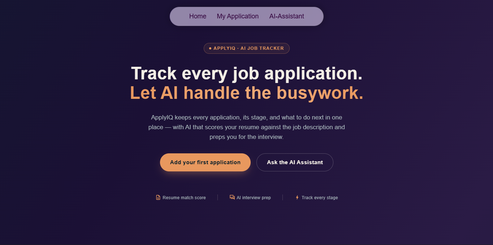

# ApplyIQ — Job Application Tracker with AI

A job application tracker that also checks how well your resume matches a job, and helps you prep for the interview — instead of just being a list of companies you applied to.

## Why I built this

Most job trackers just let you save a list of applications. That's fine, but it doesn't help with the actual problem — a lot of people don't know why they're not getting replies. Usually it's because their resume isn't matching what the job description is actually asking for.

So along with tracking, ApplyIQ does two extra things:
1. Checks your resume against a job description and tells you what's missing.
2. Generates interview questions based on that same job, not generic ones.

## What's working right now

- **Resume & Job Match** — paste a job description and upload your resume (PDF), and it gives you a match score out of 100, a list of matched skills, missing skills, your strengths, and a few suggestions to improve your resume for that specific job.
- **AI Interview Prep** — pick a role, difficulty level, and focus areas (Technical / Behavioral / HR), and it generates real interview questions split by category, based on Google's Gemini API.
- Responsive layout — built and tested to work across mobile, tablet, and desktop screen sizes.

## Built with

- React
- Material UI (MUI)
- Google Gemini API (via Vercel serverless functions)
- pdfjs-dist for reading resume PDFs in the browser
- Deployed on Vercel

## 📸 Preview

### Home Page

  

## AI Usage Note

The AI features in this project use the **Gemini API** to generate Resume & Job Description Match results and Interview Preparation questions.

The project currently uses the Gemini API's available usage limits. Because of these limits, the AI features may become temporarily unavailable after the daily request quota is reached. The daily quota is reset periodically, after which the AI features can be used again.

If the usage limit is reached, the application will display a message informing the user that the AI service is temporarily unavailable. The rest of the application remains available to explore.

## About me

Made by Ashlesha Meshram — learning frontend development, building this as a portfolio project.